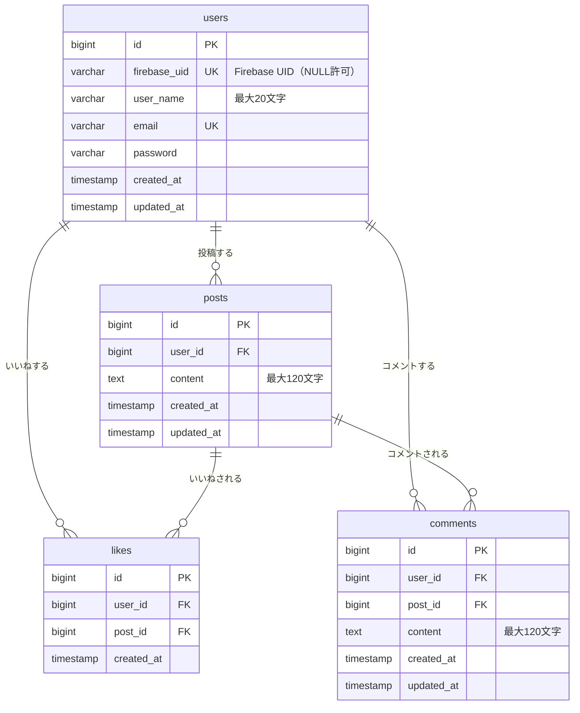

# Twitter 風 SNS アプリ

## プロジェクトの概要

何気ないことをつぶやくことができる Twitter 風 SNS アプリケーションです。ユーザーが投稿を作成し、他のユーザーの投稿にいいねやコメントを付けることができるプラットフォームを提供します。

### 主な機能

- **ユーザー認証・管理**
  - Firebase Authentication による新規登録・ログイン・ログアウト
  - ユーザー情報の管理

- **投稿機能**
  - 投稿の作成・削除
  - 投稿一覧の表示（ユーザー名、投稿内容、いいね数）
  - 投稿詳細の表示
  - ページネーション対応

- **いいね機能**
  - 投稿へのいいね追加/削除（トグル機能）
  - いいね数のリアルタイム表示

- **コメント機能**
  - 投稿へのコメント追加
  - コメント一覧の表示（ユーザー名、コメント内容）

- **その他**
  - レスポンシブデザイン対応
  - バリデーション機能

## 使用技術

### フロントエンド

- **Next.js** 15.x
- **TypeScript**
- **Firebase Authentication** (認証機能)

### バックエンド

- **PHP** ^7.3|^8.0
- **Laravel** 8.x
- **MySQL** 8.0

### 認証

- **Firebase Authentication** (メールアドレスとパスワードによる認証)

### 開発・運用環境

- **Docker** & **Docker Compose**
- **Nginx**
- **PHPMyAdmin** (データベース管理)
- **MailHog** (メール送信テスト)

### 開発ツール

- **PHPStan** (静的解析)
- **PHP CodeSniffer** (コード規約チェック)
- **PHP CS Fixer** (コード整形)
- **PHPUnit** (テスト)

## 環境構築手順

### 前提条件

以下のソフトウェアがインストールされていることを確認してください：

- Docker Desktop
- Docker Compose

### 1. リポジトリのクローン

```bash
# SSHでクローンする場合
git clone git@github.com:<your-username>/modern-app.git

# HTTPSでクローンする場合
git clone https://github.com/<your-username>/modern-app.git

cd modern-app
```

### 2. 環境の起動

```bash
# Dockerコンテナをビルドして起動
docker compose up -d --build
```

### 3. Laravel アプリケーションのセットアップ

```bash
# PHPコンテナに入る
docker compose exec php bash

# 依存関係のインストール
composer install

# 環境設定ファイルのコピー
cp .env.example .env

# アプリケーションキーの生成
php artisan key:generate
```

#### 3.1 .env の設定

コピーした `.env` に以下を設定してください：

```bash
# DB接続情報（Dockerコンテナ間通信用）
DB_HOST=mysql
DB_DATABASE=laravel_db
DB_USERNAME=laravel_user
DB_PASSWORD=laravel_pass

# Firebase設定（本番環境 / Firebase を使う場合）
FIREBASE_PROJECT_ID=your-firebase-project-id
FIREBASE_JWKS_JSON=         # Firebase の公開鍵 JSON（本番環境で必要）
FIREBASE_AUTH_DISABLED=false

# ローカル開発で Firebase を使わない場合
# FIREBASE_AUTH_DISABLED=true
# FIREBASE_JWKS_JSON は不要
```

#### 3.2 データベースマイグレーションの実行

```bash
# PHPコンテナ内で実行
php artisan migrate:fresh --seed
```

### 4. フロントエンドのセットアップ

PHPコンテナから出て、ホストマシンで以下を実行してください：

```bash
cd frontend

# 環境変数ファイルを作成
# （Firebase を使う場合は Firebase Console から値を取得して設定）
cp .env.example .env.local   # またはファイルを手動作成

# 依存関係のインストール
npm install

# 開発サーバーの起動
npm run dev
```

`frontend/.env.local` に設定する内容：

```bash
# Firebase 設定（Firebase を使う場合）
NEXT_PUBLIC_FIREBASE_API_KEY=your-api-key-here
NEXT_PUBLIC_FIREBASE_AUTH_DOMAIN=your-project-id.firebaseapp.com
NEXT_PUBLIC_FIREBASE_PROJECT_ID=your-project-id
NEXT_PUBLIC_FIREBASE_STORAGE_BUCKET=your-project-id.appspot.com
NEXT_PUBLIC_FIREBASE_MESSAGING_SENDER_ID=your-messaging-sender-id
NEXT_PUBLIC_FIREBASE_APP_ID=your-app-id

# API ベース URL
NEXT_PUBLIC_API_BASE_URL=/api
```

### 5. 動作確認

ブラウザで以下の URL にアクセスして、アプリケーションが正常に動作することを確認してください：

- **フロントエンド (Next.js)**: <http://localhost:3000>
- **バックエンド API**: <http://localhost/api>
- **PHPMyAdmin**: <http://localhost:8080>
- **MailHog**: <http://localhost:8025>

### 6. 2 回目以降の起動

```bash
# Dockerコンテナの起動
docker compose up -d

# フロントエンド開発サーバーの起動
cd frontend && npm run dev
```

## API エンドポイント

### 認証関連

- **POST /api/auth/register**: Firebase 認証後にユーザー情報を Laravel DB に登録

### ユーザー関連

- **GET /api/user**: 現在のログインユーザー情報を取得（認証必須）

### 投稿関連

- **GET /api/posts**: 投稿一覧を取得（ページネーション対応）
- **POST /api/posts**: 新しい投稿を追加（認証必須、120 文字以内）
- **GET /api/posts/{id}**: 指定された投稿を取得
- **DELETE /api/posts/{id}**: 投稿を削除（認証必須、投稿者のみ）

### いいね関連

- **POST /api/posts/{id}/like**: いいねの追加/削除を切り替える（認証必須、トグル機能）

### コメント関連

- **GET /api/posts/{id}/comments**: 指定された投稿のコメント一覧を取得
- **POST /api/posts/{id}/comments**: 指定された投稿にコメントを追加（認証必須、120 文字以内）

詳細な API 仕様については上記テーブルを参照してください。

## Firebase Authentication の設定

### 設定手順

1. **Firebase プロジェクトの作成**
   - [Firebase Console](https://console.firebase.google.com/) にアクセス
   - 「プロジェクトを追加」をクリック
   - プロジェクト名を入力して作成

2. **Authentication の有効化（重要）**
   - Firebase Console で「Authentication」を選択
   - 「始める」をクリック（初回の場合）
   - 「Sign-in method」タブを開く
   - 「メール/パスワード」を選択
   - 「有効にする」をクリック
   - 「保存」をクリック
   - ⚠️ **この手順を忘れると `auth/configuration-not-found` エラーが発生します**

3. **Firebase 設定情報の取得**
   - Firebase Console で「プロジェクトの設定」（歯車アイコン）をクリック
   - 「アプリを追加」→「ウェブ」（</>）を選択
   - アプリ名を入力して登録
   - 表示された設定情報をコピー

4. **Next.js アプリに環境変数を設定**
   - `frontend/.env.local` ファイルを作成して Firebase の設定値を記入
   - （「[フロントエンドのセットアップ](#4-フロントエンドのセットアップ)」参照）

5. **Laravel 側の Firebase トークン検証**
   - Laravel 側では `FirebaseAuthenticate` ミドルウェアが実装済み
   - `backend/src/.env` の `FIREBASE_PROJECT_ID` にプロジェクト ID を設定
   - Firebase トークンが自動的に検証されます

## ローカル開発での動作確認（Firebase 認証スキップ）

Firebase プロジェクトを用意しなくても、`FIREBASE_AUTH_DISABLED=true` を設定することで API の動作確認ができます。

> **注意**: この設定はローカル開発専用です。本番環境では必ず `FIREBASE_AUTH_DISABLED=false` にしてください。

### 設定手順

`backend/src/.env` を以下のように設定します：

```bash
# Firebase 認証を無効化（ローカル開発専用）
FIREBASE_AUTH_DISABLED=true

# FIREBASE_JWKS_JSON の設定は不要
```

設定変更後、Laravel のキャッシュをクリアしてください：

```bash
docker compose exec php php artisan config:clear
```

### 使い方

#### 1. テストユーザーの登録

`firebase_uid` には任意の文字列を設定できます：

```bash
curl -X POST http://localhost/api/auth/register \
  -H "Content-Type: application/json" \
  -d '{
    "firebase_uid": "dev_uid_001",
    "user_name": "devuser",
    "email": "dev@example.com"
  }'
```

#### 2. 認証が必要なエンドポイントへのアクセス

`X-Debug-Firebase-Uid` ヘッダーに登録済みの `firebase_uid` を指定します：

```bash
# 投稿を作成する
curl -X POST http://localhost/api/posts \
  -H "X-Debug-Firebase-Uid: dev_uid_001" \
  -H "Content-Type: application/json" \
  -d '{"content": "テスト投稿"}'

# いいねをする
curl -X POST http://localhost/api/posts/1/like \
  -H "X-Debug-Firebase-Uid: dev_uid_001"

# コメントを追加する
curl -X POST http://localhost/api/posts/1/comments \
  -H "X-Debug-Firebase-Uid: dev_uid_001" \
  -H "Content-Type: application/json" \
  -d '{"content": "テストコメント"}'

# 投稿を削除する（自分の投稿のみ）
curl -X DELETE http://localhost/api/posts/1 \
  -H "X-Debug-Firebase-Uid: dev_uid_001"
```

#### 3. 認証なし（公開エンドポイント）

投稿一覧などはヘッダーなしでアクセスできます：

```bash
curl http://localhost/api/posts
```

### 動作の仕組み

| 状況                                                          | 動作                                   |
| ------------------------------------------------------------- | -------------------------------------- |
| `FIREBASE_AUTH_DISABLED=false`（本番）                        | Firebase JWT を検証する通常フロー      |
| `FIREBASE_AUTH_DISABLED=true` + ヘッダーなし                  | 認証なしで通過（公開エンドポイント用） |
| `FIREBASE_AUTH_DISABLED=true` + `X-Debug-Firebase-Uid: {uid}` | 該当ユーザーでログイン状態にする       |
| `FIREBASE_AUTH_DISABLED=true` + 存在しない UID                | 401 を返す（安全）                     |

---

## 開発時の操作

### コンテナの操作

```bash
# コンテナを停止
docker compose stop

# コンテナを停止して削除
docker compose down

# コンテナを再起動
docker compose restart
```

### ログの確認

```bash
# 全サービスのログを確認
docker compose logs

# 特定のサービスのログを確認
docker compose logs nginx
docker compose logs php
docker compose logs mysql
```

### コンテナ内での作業

```bash
# PHPコンテナに入る
docker compose exec php bash

# Nginxコンテナに入る
docker compose exec nginx bash

# MySQLコンテナに入る
docker compose exec mysql bash
```

### MySQL への直接アクセス

```bash
docker compose exec mysql mysql -u laravel_user -plaravel_pass laravel_db
```

### 開発用コマンド

```bash
# PHPコンテナ内で実行

# マイグレーションの実行
php artisan migrate

# シーダーの実行
php artisan db:seed

# テストの実行
docker compose exec php php artisan test
```

## ファイル構成

```text
modern-app/
├── docker/                 # Docker設定
│   ├── nginx/
│   │   └── default.conf    # Nginx設定
│   ├── php/
│   │   ├── Dockerfile      # PHP Dockerfileq
│   │   └── php.ini         # PHP設定
│   └── mysql/
│       └── my.cnf          # MySQL設定
├── backend/                # バックエンド
│   └── src/                # Laravelアプリケーション
│       ├── app/
│       │   ├── Domain/         # ドメイン層
│       │   │   ├── Comment/
│       │   │   │   ├── Entities/
│       │   │   │   └── Repositories/
│       │   │   ├── Like/
│       │   │   │   ├── Entities/
│       │   │   │   └── Repositories/
│       │   │   ├── Post/
│       │   │   │   ├── Entities/
│       │   │   │   └── Repositories/
│       │   │   └── User/
│       │   │       ├── Entities/
│       │   │       └── Repositories/
│       │   ├── Http/           # プレゼンテーション層
│       │   │   ├── Controllers/
│       │   │   ├── Middleware/
│       │   │   └── Requests/
│       │   ├── Infrastructure/ # インフラストラクチャ層
│       │   │   └── Repositories/
│       │   └── Models/         # Eloquentモデル
│       ├── database/           # マイグレーション・シーダー
│       ├── routes/             # ルート定義
│       └── tests/              # テストコード
├── frontend/               # フロントエンド（Next.js）
│   └── src/
│       ├── app/            # App Router
│       │   ├── actions/    # APIクライアント
│       │   ├── login/      # ログインページ
│       │   ├── register/   # 新規登録ページ
│       │   └── posts/
│       │       └── [id]/
│       │           └── comments/  # コメントページ
│       ├── components/     # 共通コンポーネント
│       ├── hooks/          # カスタムフック
│       ├── lib/            # ユーティリティ・Firebase設定
│       └── types/          # 型定義
├── docs/                   # ドキュメント
├── docker-compose.yaml     # Docker Compose設定
└── README.md               # このファイル
```

## データベース設計

### ER 図



### テーブル設計

#### users テーブル

| カラム名     | データ型        | NULL | キー        | 説明                           |
| ------------ | --------------- | ---- | ----------- | ------------------------------ |
| id           | bigint unsigned | NO   | PRIMARY KEY | 自動採番                       |
| firebase_uid | varchar(255)    | YES  | UNIQUE      | Firebase Authentication の UID |
| user_name    | varchar(255)    | NO   | -           | ユーザー名（最大20文字）       |
| email        | varchar(255)    | NO   | UNIQUE      | メールアドレス                 |
| password     | varchar(255)    | NO   | -           | パスワード（ハッシュ化）       |
| created_at   | timestamp       | YES  | -           | 作成日時                       |
| updated_at   | timestamp       | YES  | -           | 更新日時                       |

#### posts テーブル

| カラム名   | データ型        | NULL | キー        | 説明                            |
| ---------- | --------------- | ---- | ----------- | ------------------------------- |
| id         | bigint unsigned | NO   | PRIMARY KEY | 自動採番                        |
| user_id    | bigint unsigned | NO   | FOREIGN KEY | 投稿者（users.id、CASCADE削除） |
| content    | text            | NO   | -           | 投稿内容（最大120文字）         |
| created_at | timestamp       | YES  | -           | 作成日時                        |
| updated_at | timestamp       | YES  | -           | 更新日時                        |

#### likes テーブル

| カラム名   | データ型        | NULL | キー        | 説明                                        |
| ---------- | --------------- | ---- | ----------- | ------------------------------------------- |
| id         | bigint unsigned | NO   | PRIMARY KEY | 自動採番                                    |
| user_id    | bigint unsigned | NO   | FOREIGN KEY | いいねしたユーザー（users.id、CASCADE削除） |
| post_id    | bigint unsigned | NO   | FOREIGN KEY | いいねされた投稿（posts.id、CASCADE削除）   |
| created_at | timestamp       | NO   | -           | 作成日時                                    |

> `user_id` + `post_id` の組み合わせに**複合ユニーク制約**あり（同一ユーザーが同一投稿に重複していいね不可）

#### comments テーブル

| カラム名   | データ型        | NULL | キー        | 説明                                          |
| ---------- | --------------- | ---- | ----------- | --------------------------------------------- |
| id         | bigint unsigned | NO   | PRIMARY KEY | 自動採番                                      |
| user_id    | bigint unsigned | NO   | FOREIGN KEY | コメントしたユーザー（users.id、CASCADE削除） |
| post_id    | bigint unsigned | NO   | FOREIGN KEY | コメント先の投稿（posts.id、CASCADE削除）     |
| content    | text            | NO   | -           | コメント内容（最大120文字）                   |
| created_at | timestamp       | YES  | -           | 作成日時                                      |
| updated_at | timestamp       | YES  | -           | 更新日時                                      |

詳細なデータベース設計については上記テーブル設計を参照してください。

## コーディングルール

本プロジェクトでは、以下の命名規則を厳密に遵守します：

- **モデル**: 単数形、パスカルケース（例: `Post.php`, `User.php`）
- **テーブル**: 複数形、スネークケース（例: `posts`, `users`）
- **コントローラ**: 単数形、パスカルケース（例: `PostController.php`）
- **クラス**: 単数形、パスカルケース
- **メソッド**: キャメルケース（例: `getPostById()`）
- **変数**: スネークケース（例: `$user_name`, `$post_id`）

詳細なコーディングルールについては開発チームの規約を参照してください。

## トラブルシューティング

### ポート競合の場合

ポート 80 が使用中の場合、`docker-compose.yaml` を編集：

```yaml
services:
  nginx:
    ports:
      - "8080:80" # ホストの8080ポートを使用
```

アクセス URL: <http://localhost:8080>

### コンテナが起動しない場合

```bash
# コンテナの状態確認
docker compose ps

# ログでエラー確認
docker compose logs

# 完全にクリーンアップして再構築
docker compose down --volumes --remove-orphans
docker compose up --build
```

### データベース接続エラー

```bash
# PHPコンテナ内で接続確認
docker compose exec php php artisan tinker
DB::connection()->getPdo();
```

### Firebase Authentication エラー

#### Firebase を使わずにローカルで動作確認したい場合

「[ローカル開発での動作確認（Firebase 認証スキップ）](#ローカル開発での動作確認firebase-認証スキップ)」セクションを参照してください。`FIREBASE_AUTH_DISABLED=true` を設定することで、Firebase プロジェクトなしで API の動作確認ができます。

#### `auth/configuration-not-found` エラーが発生する場合

このエラーは、Firebase Console で Authentication（メール/パスワード）が有効化されていない場合に発生します。

**対処法：**

1. [Firebase Console](https://console.firebase.google.com/) にアクセス
2. プロジェクトを選択
3. 左メニューから「Authentication」を選択
4. 「始める」をクリック（初回の場合）
5. 「Sign-in method」タブを開く
6. 「メール/パスワード」を選択
7. 「有効にする」をクリック
8. 「保存」をクリック
9. ブラウザをリロードして再度試してください

**確認方法：**

- Firebase Console の「Authentication」→「Sign-in method」で「メール/パスワード」が「有効」になっていることを確認
- ブラウザのコンソールで Firebase 初期化成功のログが表示されることを確認
