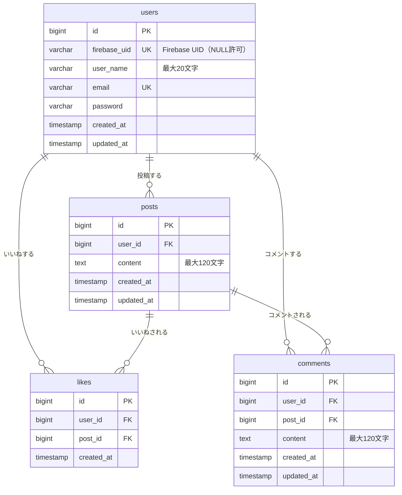

# データベース設計書

## 目次

1. [テーブル定義](#テーブル定義)
2. [ER 図](#er図)

---

## テーブル定義

### users テーブル

ユーザー情報を管理するテーブル

| カラム名     | データ型        | NULL | デフォルト値                                  | 説明                             |
| ------------ | --------------- | ---- | --------------------------------------------- | -------------------------------- |
| id           | unsigned bigint | NO   | AUTO_INCREMENT                                | ユーザー ID（主キー）            |
| firebase_uid | varchar(255)    | YES  | -                                             | Firebase Authentication の UID   |
| user_name    | varchar(255)    | NO   | -                                             | ユーザー名（最大 20 文字）       |
| email        | varchar(255)    | NO   | -                                             | メールアドレス（ユニーク）       |
| password     | varchar(255)    | NO   | -                                             | パスワード（ハッシュ化）         |
| created_at   | timestamp       | YES  | NULL                                          | 作成日時                         |
| updated_at   | timestamp       | YES  | NULL                                          | 更新日時                         |

**インデックス**

- PRIMARY KEY: `id`
- UNIQUE KEY: `email`
- UNIQUE KEY: `firebase_uid`

---

### posts テーブル

投稿情報を管理するテーブル

| カラム名   | データ型        | NULL | デフォルト値   | 説明                              |
| ---------- | --------------- | ---- | -------------- | --------------------------------- |
| id         | unsigned bigint | NO   | AUTO_INCREMENT | 投稿 ID（主キー）                 |
| user_id    | unsigned bigint | NO   | -              | ユーザー ID（外部キー）           |
| content    | text            | NO   | -              | 投稿内容（最大 120 文字）         |
| created_at | timestamp       | YES  | NULL           | 作成日時                          |
| updated_at | timestamp       | YES  | NULL           | 更新日時                          |

**インデックス**

- PRIMARY KEY: `id`
- FOREIGN KEY: `user_id` → `users.id` (ON DELETE CASCADE)

---

### likes テーブル

いいね情報を管理するテーブル

| カラム名   | データ型        | NULL | デフォルト値      | 説明                    |
| ---------- | --------------- | ---- | ----------------- | ----------------------- |
| id         | unsigned bigint | NO   | AUTO_INCREMENT    | いいね ID（主キー）     |
| user_id    | unsigned bigint | NO   | -                 | ユーザー ID（外部キー） |
| post_id    | unsigned bigint | NO   | -                 | 投稿 ID（外部キー）     |
| created_at | timestamp       | NO   | CURRENT_TIMESTAMP | 作成日時                |

**インデックス**

- PRIMARY KEY: `id`
- FOREIGN KEY: `user_id` → `users.id` (ON DELETE CASCADE)
- FOREIGN KEY: `post_id` → `posts.id` (ON DELETE CASCADE)
- UNIQUE KEY: `user_id`, `post_id`（同一ユーザーが同一投稿に複数回いいねできないようにする）

---

### comments テーブル

コメント情報を管理するテーブル

| カラム名   | データ型        | NULL | デフォルト値   | 説明                              |
| ---------- | --------------- | ---- | -------------- | --------------------------------- |
| id         | unsigned bigint | NO   | AUTO_INCREMENT | コメント ID（主キー）             |
| user_id    | unsigned bigint | NO   | -              | ユーザー ID（外部キー）           |
| post_id    | unsigned bigint | NO   | -              | 投稿 ID（外部キー）               |
| content    | text            | NO   | -              | コメント内容（最大 120 文字）     |
| created_at | timestamp       | YES  | NULL           | 作成日時                          |
| updated_at | timestamp       | YES  | NULL           | 更新日時                          |

**インデックス**

- PRIMARY KEY: `id`
- FOREIGN KEY: `user_id` → `users.id` (ON DELETE CASCADE)
- FOREIGN KEY: `post_id` → `posts.id` (ON DELETE CASCADE)

---

## ER 図

### カーディナリティの説明

#### users と posts の関係

- **カーディナリティ**: 1 対多（1:N）
- **説明**: 1 人のユーザーは複数の投稿を作成できる。1 つの投稿は 1 人のユーザーに属する。

#### users と likes の関係

- **カーディナリティ**: 1 対多（1:N）
- **説明**: 1 人のユーザーは複数の投稿にいいねできる。1 つのいいねは 1 人のユーザーに属する。

#### users と comments の関係

- **カーディナリティ**: 1 対多（1:N）
- **説明**: 1 人のユーザーは複数のコメントを投稿できる。1 つのコメントは 1 人のユーザーに属する。

#### posts と likes の関係

- **カーディナリティ**: 1 対多（1:N）
- **説明**: 1 つの投稿には複数のいいねが付けられる。1 つのいいねは 1 つの投稿に属する。

#### posts と comments の関係

- **カーディナリティ**: 1 対多（1:N）
- **説明**: 1 つの投稿には複数のコメントが付けられる。1 つのコメントは 1 つの投稿に属する。

---

## 機能要件との対応

| 機能 ID | 機能名       | 使用テーブル           |
| ------- | ------------ | ---------------------- |
| 1       | ユーザー登録 | users                  |
| 2       | 投稿一覧取得 | posts, users           |
| 3       | 投稿追加     | posts                  |
| 4       | 投稿削除     | posts, likes, comments |
| 5       | いいね追加   | likes                  |
| 6       | いいね削除   | likes                  |
| 7       | コメント追加 | comments               |

---

## 注意事項

1. **外部キー制約**: すべての外部キーに `ON DELETE CASCADE` を設定しており、親レコードが削除されると関連する子レコードも自動的に削除されます。

2. **ユニーク制約**:
   - `users.email`: メールアドレスの重複を防ぐ
   - `users.firebase_uid`: Firebase UID の重複を防ぐ
   - `likes.user_id, likes.post_id`: 同一ユーザーが同一投稿に複数回いいねできないようにする

3. **データ型**: すべての ID カラムは `unsigned bigint` を使用しており、大量のデータにも対応可能です。

4. **タイムスタンプ**: `created_at` と `updated_at` は自動的に管理され、レコードの作成・更新時刻を記録します。なお `likes` テーブルには `updated_at` はありません。
